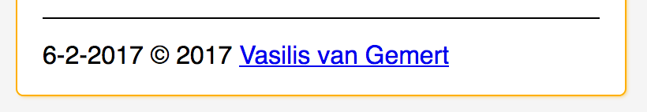
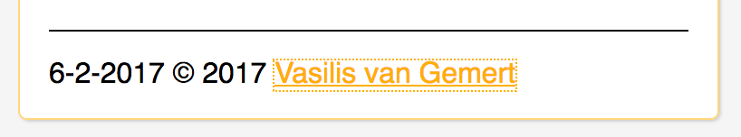

# Components

## setup
Before you open this website, please setup your machine for the best experience.

## Website
* Open in Safari for the best voice-over support on mac.
* Go to [setup](https://iiyama12.github.io/cssttr/setup) to make use of all features.

[Website](https://iiyama12.github.io/cssttr/styleguide.html)

## Tab navigation support
Each component on the page is reachable with the tab key. When and component has been selected, it will show an orange border around it. This border will also be shown (but dimmed) when a sub-component has been focused down.

#### Focus component

#### Focus sub component

## Responsive
As it is unclear which device the user is going to use, the webpage is responsive for mobile, tablet and mobile.
