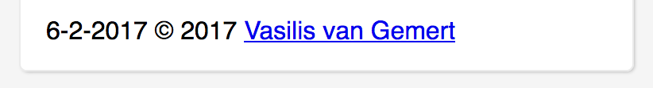

# CSSTTR

## Intro
This website has been build for Marijn. A person which I have never met and the only thing I know about him, is that he seems to be very good programmer. And as he does his job, his motor disability doesn't make his work easier. I am really impressed how he is capable using the shitty websites of today.

When a person is not able to use the mouse, there is always the keyboard as backup. Almost every personal computer has one, so if I am going to build something which has to be supported globally, then that would be the first thing to be full supported.


## Setup
Before you open this website, please setup your machine for the best experience.

## Website
* Open in Safari for the best voice-over support on mac.
* Go to [setup](https://iiyama12.github.io/cssttr/setup) to make use of all features.


[Website](https://iiyama12.github.io/cssttr/styleguide.html)


## Tab navigation support
Each component on the page is reachable with the tab key. When and component has been selected, it will show an orange border around it. This border will also be shown (but dimmed) when a sub-component has been focused down.

#### No focus component


#### Focus component


#### Focus sub component


## Responsive
As it is unclear which device the user is going to use, the webpage is responsive for mobile, tablet and mobile.

## Best practices

### Pseudo-class focus-within
The focus-within pseudo-class seems to be very powerful for apply styling to all elements within a specific parent. After using it I noticed that I do have to write 50% less micro-interactions with JavaScript.

```CSS
body:focus-within button {
    /*    ...    */
}
```

### Debug viewport
Debugging of the viewport using the `content` property made it a lot easier to build it with a responsive layout.

```CSS
#debug-viewport:after {
    content: "mobile";
    color: red;
    position: fixed;
    top: 0;
    z-index: 1000;
    font-size: 2rem;
}

@media (min-width: 40rem) and (max-width: 80rem) {
    #debug-viewport:after {
        content: "tablet";
    }
}

@media (min-width: 60em) {
    #debug-viewport:after {
        content: "desktop";
    }
}
```

```HTML
    <p id="debug-viewport"></p>
```

### Attribute selectors
We normally use a lot of classes to style things. But an already existing attribute selector will do the job also just fine. I am not sure what the performance is of an attribute selector. So I might just variate between an `attribute selector` and a `tagName with attribute selector attached to it`. To me a tagName with an attribute selector should be faster in my opinion, but I have yet to find that out if that is really true.

Attribute selector
```CSS
[aria-label="loader"] {
    /*    ...    */
}
```


TagName + attribute selector
```CSS
div[aria-label="loader"] {
    /*    ...    */
}
```

### cubic-bezier / single-transition-timing-function
It really surprised me that css supported custom easing. The `cubic-bezier / single-transition-timing-function` css function can be used to change the two handles which are creating the curve in between an easing. Tools like this [cubic-bezier.com](http://cubic-bezier.com/) will help you customise them exactly how you want. Unfortunately there is no way in adding more points in the easing with this function. You will need to add multiple easing's into one transition, in order to achieve this.

[single-transition-timing-function](https://developer.mozilla.org/en-US/docs/Web/CSS/single-transition-timing-function)

```CSS
    /* syntax */
    cubic-bezier(initial-handle-X, initial-handle-Y, final-handle-X, final-handle-Y)

    cubic-bezier(x1, y1, x2, y2)
```

```CSS
    /* Use in animation */
    animation: fly 1s cubic-bezier(0, 0.33, 0.78, 0.27) infinite;
    /*                                                          */
```


### The power of linear-gradient + background-size
Linear-gradient's with background-size can create a sort of patterns.
This example below will start with drawing 50px space on the left side. After that it will draw a 25px coloured line. This pattern will repeat itself, because the repeat css property is enabled by default.

```CSS
    linear-gradient(90deg, #d3d3d3 25px, transparent 0);
    background-size: 50px 100%;
    /*                                                          */
```


