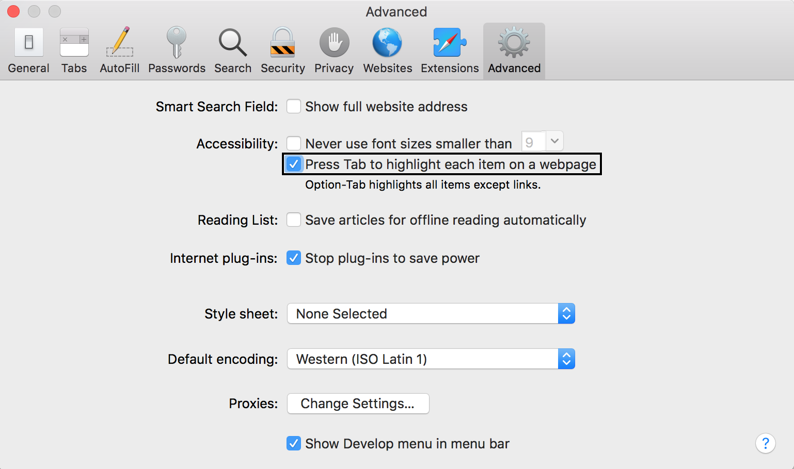
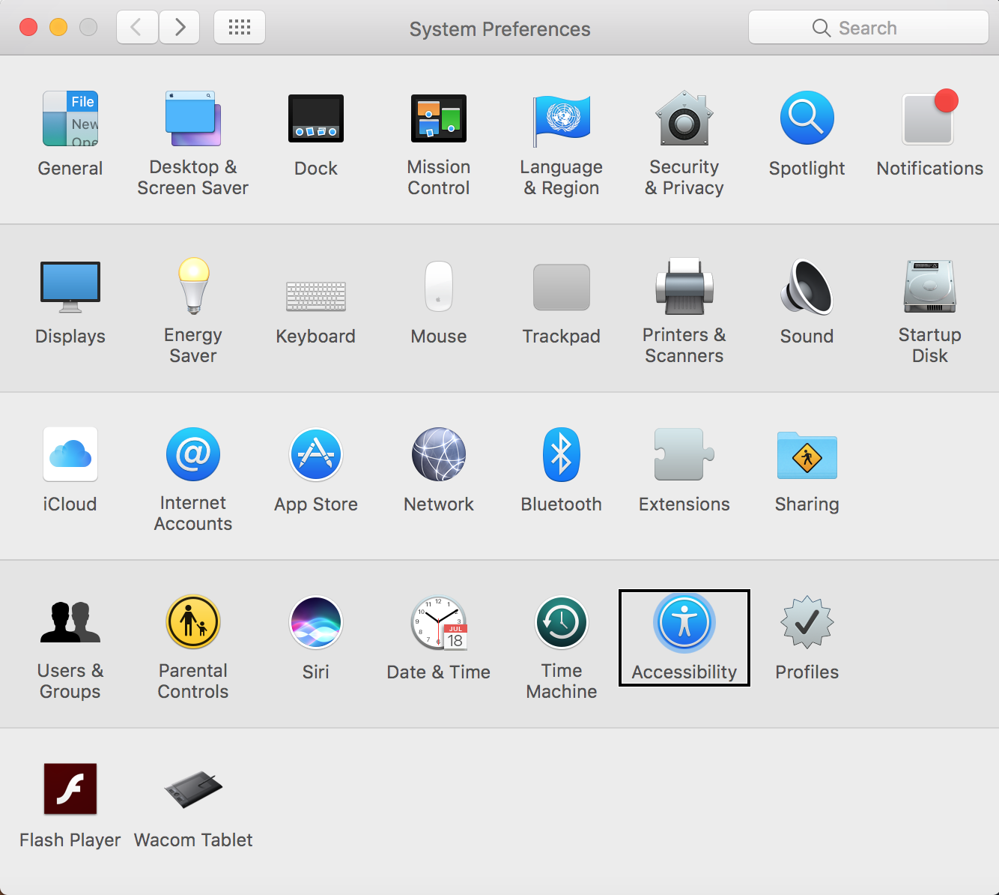
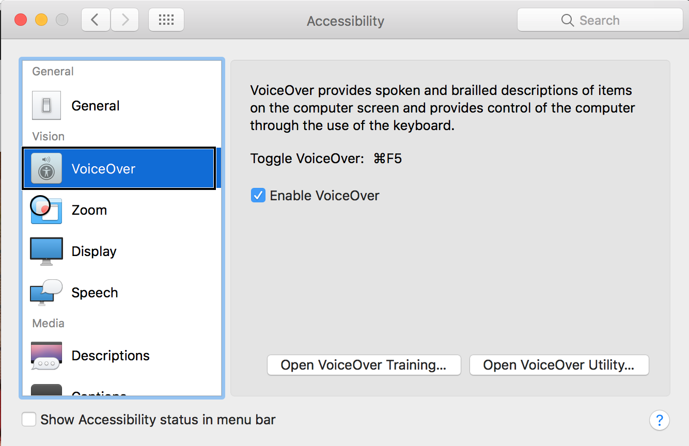
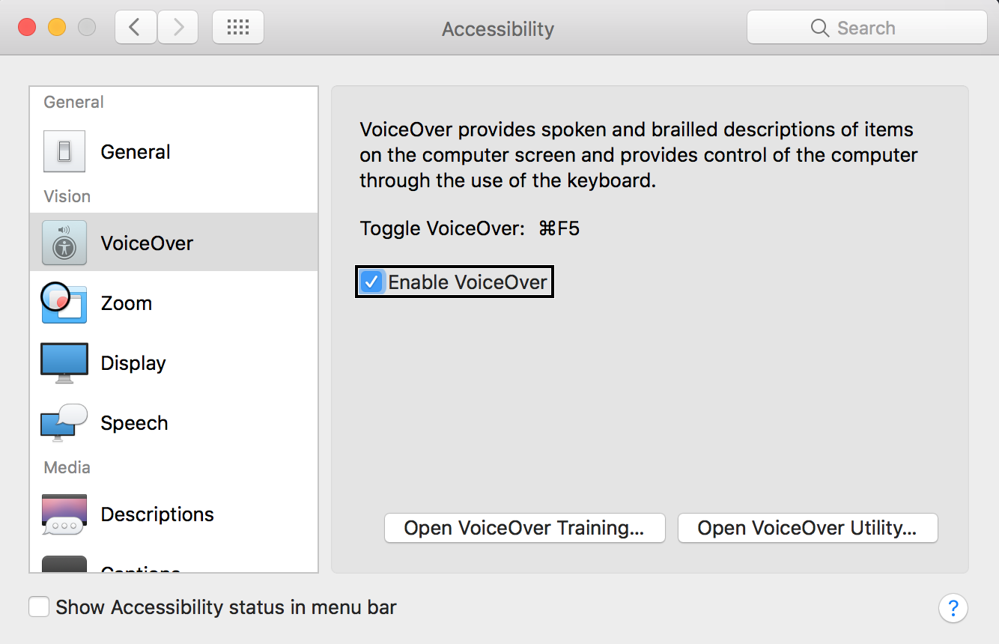

# Setup

[Return back to main readme](https://github.com/IIYAMA12/cssttr)

## Preferences Safari
* Open Safari preferences.
* Go to advanced.
* Check the checkbox: `Press tab to highlight each item on a webpage`

This will allow you to stop at links and navigation links with your tab key. I assume people with specific disabilities do enable this by default.

## Preferences voice over setup

To enable the screen voice reader for IOS included Safari, please follow the steps below.

### Step 1
Go from `system preferences` to `accessibility`.

### Step 2

Click on `voiceOver`

### Step 3

Check the checkbox: `Enable VoiceOver`

[Return back to main readme](https://github.com/IIYAMA12/cssttr)
